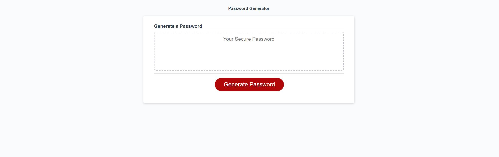

# JS-password-generator

## Description

A custom password generator that allows for varied character sets to be included within its generation and allowing for custom length within 8 to 128 characters. Made using HTML, CSS and JavaScript and hosted on GitHub pages.

## Installation

GitHub Pages link: https://prosentint.github.io/JS-password-generator/

## Usage

This webpage serves as a password generator. Click on the generate password button to be prompted to input a value. you must input a value of atleast 8 and no more than 128 to continue, otherwise you can hit cancel at this prompt to cancel the program. After entering a valid value as the length of your generated password 4 prompts in succession will ask you wether or not you wish to include the character sets of upper case letters, lower case letter, numbers, and special characters respectively. If no sets are selected the four prompts will reappear until atleast one is allowed. After atleast one char set is permitted then a random password fitting the selected specifications is generated and displayed in the text box. Hit the button to generate another.

## Credits

N/A

## License

Copyright (c) 2023 Prosentint

Permission is hereby granted, free of charge, to any person obtaining a copy
of this software and associated documentation files (the "Software"), to deal
in the Software without restriction, including without limitation the rights
to use, copy, modify, merge, publish, distribute, sublicense, and/or sell
copies of the Software, and to permit persons to whom the Software is
furnished to do so, subject to the following conditions:

The above copyright notice and this permission notice shall be included in all
copies or substantial portions of the Software.

THE SOFTWARE IS PROVIDED "AS IS", WITHOUT WARRANTY OF ANY KIND, EXPRESS OR
IMPLIED, INCLUDING BUT NOT LIMITED TO THE WARRANTIES OF MERCHANTABILITY,
FITNESS FOR A PARTICULAR PURPOSE AND NONINFRINGEMENT. IN NO EVENT SHALL THE
AUTHORS OR COPYRIGHT HOLDERS BE LIABLE FOR ANY CLAIM, DAMAGES OR OTHER
LIABILITY, WHETHER IN AN ACTION OF CONTRACT, TORT OR OTHERWISE, ARISING FROM,
OUT OF OR IN CONNECTION WITH THE SOFTWARE OR THE USE OR OTHER DEALINGS IN THE
SOFTWARE.